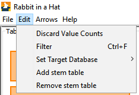
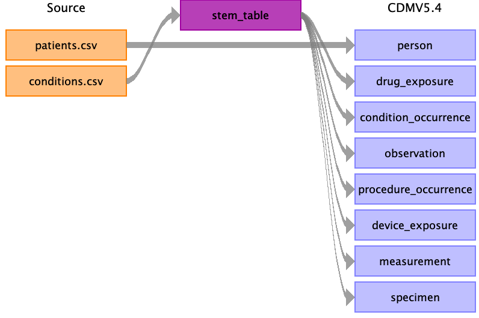
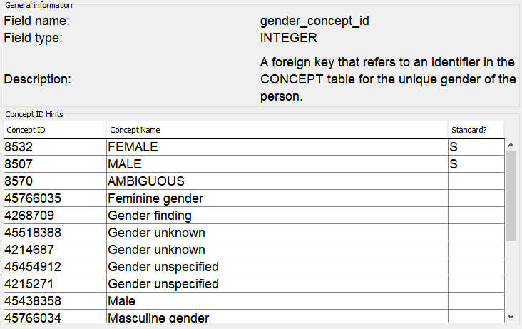

## Introduction
### Scope and purpose
Rabbit-In-a-Hat comes with WhiteRabbit and is designed to read and display a WhiteRabbit scan document.
WhiteRabbit generates information about the source data while Rabbit-In-a-Hat uses that information and through a graphical user interface to allow a user to connect source data to tables and columns within the CDM.
Rabbit-In-a-Hat generates documentation for the ETL process it does not generate code to create an ETL.

### Process Overview
The typical sequence for using this software to generate documentation of an ETL:
1. Scanned results from WhiteRabbit completed
2. Open scanned results; interface displays source tables and CDM tables
3. Connect source tables to CDM tables where the source table provides information for that corresponding CDM table
4. For each source table to CDM table connection, further define the connection with source column to CDM column detail
5. Save Rabbit-In-a-Hat work and export to a MS Word document.

## Installation and support
Rabbit-In-a-Hat comes with WhiteRabbit, refer to [WhiteRabbit's installation section](WhiteRabbit.md).

## Getting Started
### Creating a New Document
To create a new document, navigate to _File --> Open Scan Report_.
Use the “Open” window to browse for the scan document created by WhiteRabbit.
When a scan report is opened, the tables scanned will appear in orange boxes on the “Source” side of the Tables.

Save the Rabbit-In-a-Hat document by going _File --> Save as_.

Side note: the minimal requirement for a valid scan report is to have the following named columns in the *first* sheet: 'Table', 'Field', 'N rows' (numeric) and 'N rows checked' (numeric).

### Open an Existing Document
To open an existing Rabbit-In-a-Hat document use _File --> Open ETL specs_.

### Selecting Desired CDM Version
Rabbit-In-a-Hat allows you to select which CDM version (v4, v5 or v6) you'd like to built your ETL specification against.

See the graphic below for how to select your desired CDM:


The CDM version can be changed at any time, but beware that some of your existing mappings may be lost in the process.
By default, Rabbit-In-a-Hat will attempt to pereserve as many mappings between the source data and the newly selected CDM as possible.
When a new CDM is selected, Rabbit-In-a-Hat will drop any mappings if the mapping's CDM table or CDM column name no longer exist

For instance, switching from CDMv4 to CDMv5, a mapping from source to CDM person.person_source_value will be kept because the person table has person_source_value in both CDMv4 and CDMv5.
However, person.assocaited_provider_id exists only in CDMv4 and has been renamed to [person.provider_id in CDMv5](http://www.ohdsi.org/web/wiki/doku.php?id=documentation:cdm:person) and so that mapping will not be kept when switching between these two CDMs.

### Loading in a Custom CDM
There are times when users might need to load in a customized version of the CDM, for instance if they are sandboxing new features.
To load in a custom CDM schema, first you must create a CSV file that uses the same format as [the existing CDMv5 schema file](https://github.com/OHDSI/WhiteRabbit/blob/master/src/org/ohdsi/rabbitInAHat/dataModel/CDMV5.csv).

Once you have created the CSV file, load it into RiaH as shown below:


Please note that the name of the file you load in becomes the label that appears above the target tables, so "My Super File.csv" will create the label "My Super File" above the target tables, so name your CSV accordingly.

### Stem table
In some cases a source domains maps to multiple OMOP CDM target domains. 
For example lab values that map to both the measurement and observation domain. 
Using the stem table will remove some overhead of repeating the mapping for every target and will also ease implementation (see below).

The idea of the stem table is that it contains all the types of columns that you need regardless
of the CDM table the data ultimately ends up in.

Adding the stem table can be done through _Edit --> Add stem table_.



This will add the stem table to the source and target tables.
There is a pre-specified map from stem to all CDM clinical event tables, linking every stem field to one or multiple fields in the CDM.
When implementing the ETL, the vocabulary decides where a particular row mapped to stem table ultimately goes.
The [OMOP CDM Data Model Conventions](https://github.com/OHDSI/CommonDataModel/wiki/Data-Model-Conventions#content-of-each-table) words this as: 
> Write the data record into the table(s) corresponding to the domain of the Standard CONCEPT_ID(s).


 
Removing the stem table can be done through _Edit --> Remove stem table_. 
Note that this will remove any mappings already made to/from the stem table.
 
### Concept id hints (_v0.9.0_)
A number of CDM fields have a limited number of standard concept_id(s) that can be used. 
Examples are: `gender_concept_id`, `_type_concept_id`'s, `route_concept_id` and `visit_concept_id`.
To help choosing the right concept_id during ETL design, Rabbit-In-a-Hat shows the list of possible concept ids of a CDM field
when clicking on a target field. Note that all standard and non-standard target concepts with the right domain
 are shown, but the OMOP conventions only allow for standard concepts (flagged with an 'S' in the panel).



The concept id hints are stored statically in [a csv file](https://github.com/OHDSI/WhiteRabbit/blob/master/rabbitinahat/src/main/resources/org/ohdsi/rabbitInAHat/dataModel/CDMConceptIDHints_v5.0_MAR-18.csv) and are not automatically updated.
The [code used to create the aforementioned csv file](https://github.com/OHDSI/WhiteRabbit/blob/master/rabbitinahat/src/main/resources/org/ohdsi/rabbitInAHat/dataModel/concept_id_hint_select.sql) is also included in the repo.

## Connecting Source Tables to CDM Tables
It is assumed that the owners of the source data should be able to provide detail of what the data table contains, Rabbit-In-a-Hat will describe the columns within the table but will not provide the context a data owner should provide.
For the CDM tables, if more information is needed navigate to the [OMOP CDM wiki](https://github.com/ohdsi/commondatamodel/wiki) and review the current OMOP specification.

To connect a source table to a CDM table, simply hover over the source table until an arrow head appears.


Use your mouse to grab the arrow head and drag it to the corresponding CDM table.
In the example below, the _drug_claims_ data will provide information for the _drug_exposure_ table.


If you click on the arrow once it will highlight and a _Details_ window will appear in the right pane.
Use this to describe _Logic or Comments_ that someone developing the ETL code should know about this source table to CDM table mapping.


Continue this process until all tables that are needed to build a CDM are mapped to their corresponding CDM tables.
One source table can map to multiple CDM tables and one CDM table can receive multiple mappings.
There may be tables in the source data that should not be map into the CDM and there may be tables in the CDM that cannot be populated from the source data.

## Connecting Source Fields to CDM Fields
By double clicking on an arrow connecting a source and CDM table, it will open a _Fields_ pane below the arrow selected.
The _Fields_ pane will have all the source table and CDM fields and is meant to make the specific column mappings between tables.
Hovering over a source table will generate an arrow head that can then be selected and dragged to its corresponding CDM field. For example, in the _drug_claims_ to _drug_exposure_ table mapping example, the source data owners know that _patient_id_ is the patient identifier and corresponds to the _CDM.person_id_. Also, just as before, the arrow can be selected and _Logic_ and _Comments_ can be added.


If you select the source table orange box, Rabbit-In-a-Hat will expose values the source data has for that table.
This is meant to help in the process in understanding the source data and what logic may be required to handle the data in the ETL.
In the example below _ndcnum_ is selected and raw NDC codes are displayed starting with most frequent (note that in the WhiteRabbit scan a “Min cell count” could have been selected and values below that frequency will not show).


Continue this process until all source columns necessary in all mapped tables have been mapped to the corresponding CDM column.
Not all columns must be mapped into a CDM column and not all CDM columns require a mapping.
One source column may supply information to multiple CDM columns and one CDM column can receive information from multiple columns.

## Generating an ETL Document
To generate an ETL MS Word document use _File --> Generate ETL document --> Generate ETL Word document_ and select a location to save.
The ETL document can also be exported to markdown or html.
In this case, a file per target table is created and you will be prompted to select a folder.
Regardless of the format, the generated document will contain all mappings and notes from Rabbit-In-a-Hat.

Once the information is in the document, if an update is needed you must either update the information in Rabbit-In-a-Hat and regenerate the document or update the document.
If you make changes in the document, Rabbit-In-a-Hat will not read those changes and update the information in the tool.
However it is common to generate the document with the core mapping information and fill in more detail within the document.

Once the document is completed, this should be shared with the individuals who plan to implement the code to execute the ETL.
The markdown and html format enable easy publishing as a web page on e.g. Github.
A good example is the [Synthea ETL documentation](https://ohdsi.github.io/ETL-Synthea/).

## Generating a testing framework
To make sure the ETL process is working as specified, it is highly recommended to create [unit tests](https://en.wikipedia.org/wiki/Unit_testing) that evaluate the behavior of the ETL process.
To efficiently create a set of unit tests Rabbit-in-a-Hat can [generate a testing framework](riah_test_framework.md).

## Generating a SQL skeleton (_v0.9.0_)
The step after documenting your ETL process is to implement it in an ETL framework of your choice.
As many implementations involve SQL, Rabbit-In-a-Hat provides a convenience function to export your design to 
a SQL skeleton. This contains all field to field mappings, with logic/descriptions as comments, as non-functional pseudo-code.
This saves you copying names into your SQL code, but still requires you to implement the actual logic.
The general format of the skeleton is:

```
INSERT INTO <target_table> (
  <target_fields>
)
SELECT 
  <source_fields>
FROM <source_table>
;
``` 
